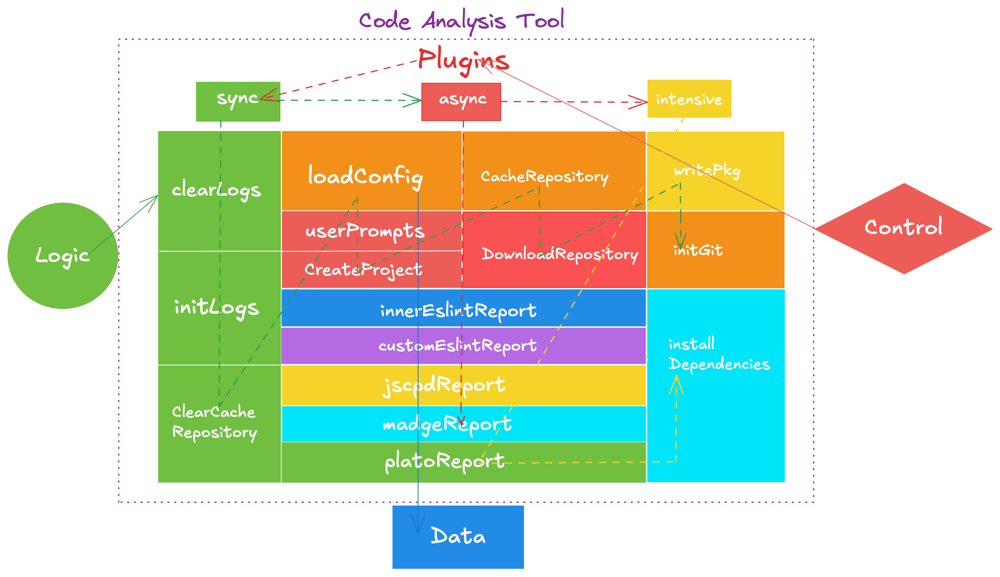

[](https://github.com/yanyunchangfeng/yycf-cli/actions/workflows/test.yml?query=branch:main) [](https://codecov.io/gh/yanyunchangfeng/yycf-cli)

<p align="center">
    
</p>

## 介绍

你好，我是[燕云长风](https://yanyunchangfeng.github.io)。  
寓意：结合李白著名的边塞诗《关山月》取【燕云长风】—— 长风几万里，吹度玉门关。

yycf-cli 是一款集项目创建与代码分析于一体的开发工具。它能够从远程 Git 仓库快速生成新项目，并通过深入的代码质量分析和可视化报告，助力开发者高效构建和优化项目

## 功能

- 创建项目：支持基于远端 git Server 仓库模版创建新项目。
- 服务配置：支持配置远端 git Server 仓库域名、组织、用户和访问令牌
- 代码分析：支持分析代码中的常见问题，包括代码风格、代码质量等，并生成数据可视化报告。
  - [eslint 指标](doc/eslint/README.md): 风格
  - [plato 指标](doc/plato/README.md): 质量
  - [jscpd 指标](doc/jscpd/README.md): 重复
  - [madge 指标](doc/madge/README.md): 依赖

## 技术架构



## 启动项目

```
   yarn start or npm start
```

## 打包项目

```
   yarn build or npm run build
```

## 使用

```
    cf/yycf create <project-name>
```

## 测试

```
   yarn test or npm test
```

## 开源许可证

MIT
